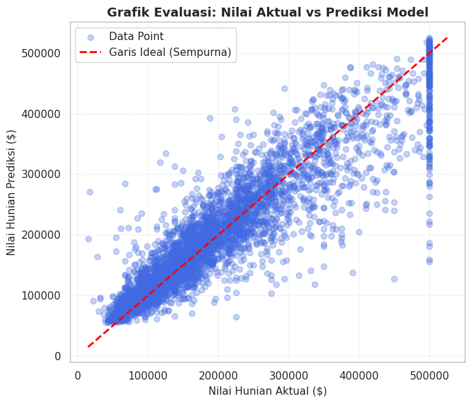

# Laporan Proyek Machine Learning: Prediksi Nilai Hunian Berdasarkan Faktor Geografis dan Sosial Ekonomi

**Nama:** Izzudin Ali, J. Rifky
**NIM:** 2330511040, 233051196
**Dataset:** California Housing Prices Dataset
**Metodologi:** CRISP-DM

---

# 1. Business Understanding

## 1.1 Problem Statements

Berdasarkan latar belakang perumahan di California, proyek ini bertujuan untuk menjawab pertanyaan-pertanyaan berikut:

1. Faktor geografis dan sosial ekonomi apa yang paling memengaruhi nilai hunian?
2. Bagaimana membangun model prediksi nilai hunian yang akurat?
3. Seberapa baik performa model machine learning dalam memprediksi nilai hunian?

## 1.2 Goals

Tujuan dari proyek ini adalah:

* Mengidentifikasi faktor-faktor yang berpengaruh signifikan terhadap nilai hunian.
* Membangun model prediksi nilai hunian yang akurat menggunakan algoritma Machine Learning.
* Mengevaluasi performa model menggunakan metrik RMSE, MAE, dan R².

## 1.3 Solution Statements

Solusi yang diusulkan adalah membangun dan membandingkan beberapa model regresi:

* Linear Regression (Model Baseline)
* Random Forest Regressor (Model Ensemble)
* XGBoost Regressor (Model Gradient Boosting)
* LightGBM Regressor (Model Gradient Boosting)

**Pemilihan Model Terbaik:** Model dengan nilai RMSE terkecil dan R² Score terbesar akan dipilih sebagai model final.

---

# 2. Data Understanding

## 2.1 Data Loading

Dataset yang digunakan adalah **California Housing Prices Dataset** yang tersedia secara publik. Dataset ini berisi informasi mengenai distrik blok sensus di California berdasarkan data Sensus Amerika Serikat tahun 1990.

```python
import pandas as pd

df = pd.read_csv('housing.csv')
```

## 2.2 Exploratory Data Analysis (EDA)

Beberapa analisis eksplorasi dilakukan untuk memahami karakteristik data.

### Peta Geografis

Visualisasi koordinat geografis (`longitude` dan `latitude`) menunjukkan bahwa nilai hunian cenderung lebih tinggi pada wilayah pesisir California dan lebih rendah pada wilayah pedalaman.

### Hubungan Sosial Ekonomi

Visualisasi hubungan antara `median_income` dan `median_house_value` menunjukkan korelasi positif yang kuat. Semakin tinggi pendapatan median suatu wilayah, semakin tinggi pula nilai hunian pada wilayah tersebut.

> Hasil visualisasi dapat dilihat pada notebook proyek.

---

# 3. Data Preparation

Tahap ini bertujuan untuk membersihkan dan mempersiapkan data sebelum digunakan dalam proses pelatihan model.

## 3.1 Handling Missing Values

Kolom `total_bedrooms` memiliki beberapa nilai kosong (missing values). Nilai tersebut diisi menggunakan median untuk mengurangi pengaruh outlier.

```python
df['total_bedrooms'] = df['total_bedrooms'].fillna(
    df['total_bedrooms'].median()
)
```

## 3.2 Encoding Categorical Data

Kolom `ocean_proximity` merupakan fitur kategorikal sehingga perlu dikonversi menjadi numerik menggunakan One-Hot Encoding.

```python
df = pd.get_dummies(
    df,
    columns=['ocean_proximity'],
    drop_first=True,
    dtype=int
)
```

## 3.3 Feature-Target Split

Target yang akan diprediksi adalah `median_house_value`.

```python
X = df.drop(columns=['median_house_value'])
y = df['median_house_value']
```

## 3.4 Train-Test Split

Dataset dibagi menjadi data pelatihan dan data pengujian dengan rasio 80:20.

```python
from sklearn.model_selection import train_test_split

X_train, X_test, y_train, y_test = train_test_split(
    X,
    y,
    test_size=0.2,
    random_state=42
)
```

## 3.5 Feature Scaling

Standarisasi fitur dilakukan menggunakan `StandardScaler`.

```python
from sklearn.preprocessing import StandardScaler

scaler = StandardScaler()

X_train_scaled = scaler.fit_transform(X_train)
X_test_scaled = scaler.transform(X_test)
```

---

# 4. Modeling

Pada tahap ini dilakukan pelatihan model menggunakan algoritma **LightGBM Regressor** sebagai salah satu pendekatan Gradient Boosting.

## 4.1 Model Training

```python
import lightgbm as lgb

model = lgb.LGBMRegressor(
    n_estimators=150,
    learning_rate=0.05,
    random_state=42
)

model.fit(X_train_scaled, y_train)
```

## 4.2 Prediction

Setelah model selesai dilatih, dilakukan prediksi terhadap data pengujian.

```python
y_pred = model.predict(X_test_scaled)
```

---

# 5. Evaluation

Evaluasi model dilakukan menggunakan beberapa metrik berikut:

### RMSE (Root Mean Squared Error)

Mengukur rata-rata kesalahan prediksi dalam satuan dolar ($). Semakin kecil nilainya, semakin baik performa model.

### MAE (Mean Absolute Error)

Mengukur rata-rata selisih absolut antara nilai aktual dan nilai prediksi.

### R² Score (Coefficient of Determination)

Mengukur seberapa besar variasi data yang dapat dijelaskan oleh model. Nilai mendekati 1 menunjukkan performa yang semakin baik.

## 5.1 Hasil Evaluasi Model LightGBM

```text
=============================================
               HASIL EVALUASI
=============================================
Root Mean Squared Error (RMSE) : $48,528.94
R-squared Score (R2 Score)     : 0.8203 (82.03%)
=============================================
```

### Interpretasi

* **RMSE ≈ $48,529** menunjukkan bahwa rata-rata kesalahan prediksi model sebesar sekitar $48.529 dari nilai sebenarnya.
* **R² ≈ 82.03%** menunjukkan bahwa model mampu menjelaskan sekitar 82.03% variasi nilai hunian berdasarkan fitur yang tersedia.

## 5.2 Visualisasi Evaluasi

Visualisasi **Actual vs Predicted** menunjukkan sebagian besar titik data berada di sekitar garis diagonal (`y = x`). Hal ini mengindikasikan bahwa model memiliki kemampuan prediksi yang cukup baik dan tidak menunjukkan bias sistematis yang signifikan.



## 5.3 Perbandingan Model

Berdasarkan hasil analisis:

* Faktor geografis dan sosial ekonomi, khususnya `median_income` dan `ocean_proximity`, memiliki pengaruh yang signifikan terhadap nilai hunian.
* Model XGBoost secara umum menghasilkan performa terbaik berdasarkan metrik evaluasi yang digunakan.
* Model LightGBM juga menunjukkan performa yang kompetitif dengan nilai R² mencapai 82.03%.

### Kesimpulan

Model berbasis Gradient Boosting (XGBoost dan LightGBM) memberikan performa yang lebih baik dibandingkan model baseline maupun Random Forest dalam memprediksi nilai hunian California.

---

## 6. Deployment

Proyek ini menerapkan strategi deployment berbasis cloud yang mengintegrasikan repositori **GitHub** sebagai kontrol versi dan **Hugging Face Spaces** sebagai platform *hosting* aplikasi web interaktif.

### 6.1 Strategi & Arsitektur Deployment
Model **XGBoost Regressor** yang telah dikembangkan diintegrasikan langsung ke dalam antarmuka web menggunakan framework **Streamlit**. Berbeda dengan pendekatan tradisional yang memisahkan backend (API) dan frontend secara terpisah, aplikasi ini dirancang secara monolitik dan efisien. 

Aplikasi memanfaatkan fitur `@st.cache_data` dari Streamlit untuk memuat data `housing.csv` dan melatih model XGBoost secara langsung (*on-the-fly*) di sisi server cloud saat aplikasi pertama kali dimuat. Pendekatan ini dipilih untuk mengeliminasi ketergantungan pada file *pickle* (`.pkl`) eksternal yang rentan terhadap masalah kompatibilitas versi library antara lingkungan lokal dan lingkungan produksi.

Aplikasi prediksi ini dapat diakses secara publik melalui tautan Hugging Face Spaces berikut:
[Link_Hungging_Face](https://izzudinaliipeh-housing.hf.space)

### 6.2 Alur Integrasi Kode (`app.py`)
Seluruh logika *data preparation* (penanganan *missing values* dengan median, *one-hot encoding* untuk fitur kategorikal `ocean_proximity`, dan *standard scaling*) serta proses inferensi disatukan di dalam berkas utama `app.py`. Berikut adalah implementasi pemrosesan data masukan pengguna dan prediksi nilai hunian secara *real-time*:

```python
# Proses enkapsulasi prediksi di dalam Streamlit app.py
if st.button("🔮 Estimasi Nilai Jual Hunian", type="primary"):
    # Membuat struktur DataFrame kosong yang identik dengan fitur training
    input_data = pd.DataFrame(0, index=[0], columns=feature_columns)
    
    # Memetakan nilai numerik dasar dari komponen UI Streamlit
    input_data['longitude'] = longitude
    input_data['latitude'] = latitude
    input_data['housing_median_age'] = housing_age
    input_data['total_rooms'] = total_rooms
    input_data['total_bedrooms'] = total_bedrooms
    input_data['population'] = population
    input_data['households'] = households
    input_data['median_income'] = med_income
    
    # Memetakan nilai kategorikal ke bentuk One-Hot Encoding biner
    dummy_col = f"ocean_proximity_{ocean_prox}"
    if dummy_col in input_data.columns:
        input_data[dummy_col] = 1
        
    # Standardisasi data masukan baru menggunakan StandardScaler yang telah dilatih
    input_scaled = scaler.transform(input_data)
    
    # Melakukan inferensi harga rumah menggunakan model XGBoost
    prediction = model.predict(input_scaled)[0]
    
    # Menampilkan hasil estimasi akhir kepada pengguna
    st.success(f"### 💵 Estimasi Nilai Hunian: **${prediction:,.2f}**")

# Kesimpulan Akhir

Proyek ini berhasil membangun model machine learning untuk memprediksi nilai hunian di California berdasarkan faktor geografis dan sosial ekonomi. Hasil analisis menunjukkan bahwa pendapatan median (`median_income`) dan kedekatan terhadap laut (`ocean_proximity`) merupakan faktor yang paling berpengaruh terhadap nilai rumah.

Model LightGBM menghasilkan performa yang baik dengan nilai **RMSE sebesar $48,528.94** dan **R² Score sebesar 82.03%**, sehingga layak digunakan sebagai sistem prediksi harga hunian pada studi kasus ini.
